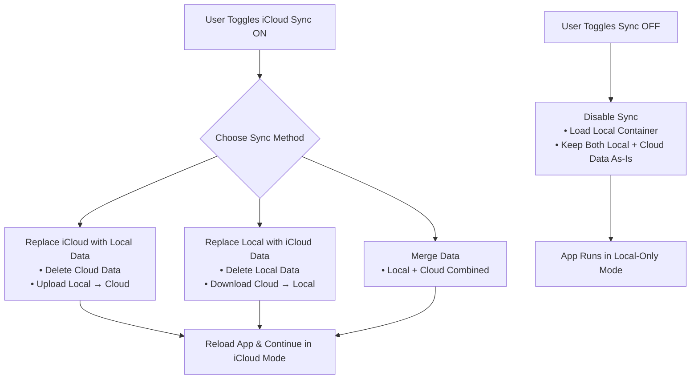

## iCloud Sync
GunVault supports optional iCloud Sync, allowing your data to stay consistent across all your devices. Sync can be enabled or disabled at any time, and you will always have full control over what happens to your local and cloud copies of your vault.

### What iCloud Sync Does

- Stores your Gunvault data in a private iCloud database that only your Apple ID can access.
- Keeps your local on-device copy and iCloud copy synchronized.
- Allows seamless switching between:
  - Local-only mode
  - iCloud Sync enabled

GunVault never shares your data with any server other than your personal iCloud account.

## Turning iCloud Sync ON
When you toggle Enable iCloud Sync, you must choose how Gunvault should initialize cloud syncing:

### 1. Replace iCloud With Local Data
Your current device’s data becomes the new source of truth.
- Cloud data is deleted
- Local data is uploaded
- Use this if your device has the most accurate data

### 2. Replace Local With iCloud Data

Your device discards its local copy and downloads whatever is in iCloud.
- Local data is deleted
- Cloud data overwrites it
- Use this if another device already has the most accurate data

### 3. Merge Local + Cloud

Gunvault keeps both datasets and merges them.
- Items from local and cloud are combined
- Duplicates could be created
- No data is deleted

## Turning iCloud Sync OFF

When you disable iCloud Sync:
- Gunvault simply switches to local-only mode
- Your local database remains intact
- Cloud data remains untouched
(unless you explicitly choose the “Wipe Cloud” option, available internally)

## Sync Flow Diagram

